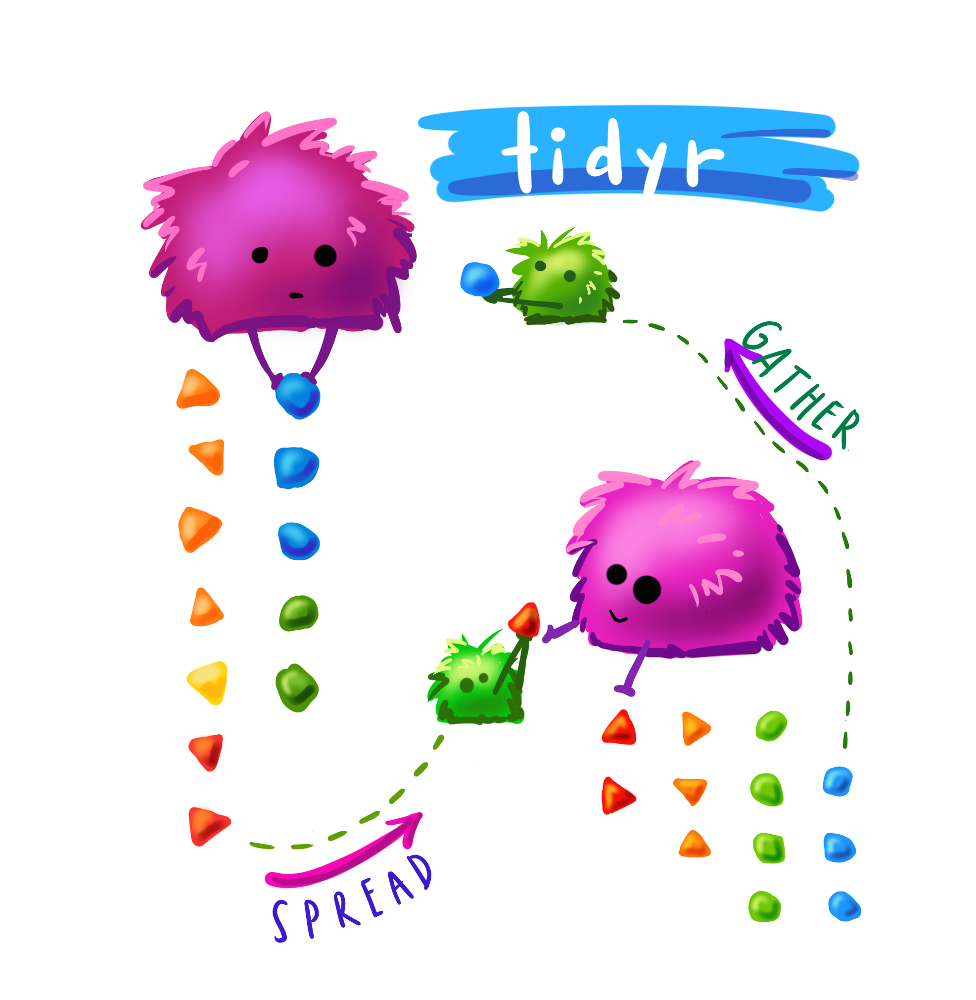

**Part of the DGfS PhD students' forum, 23 February 2021**

Instructors: Kyla McConnell and Julia Müller  
Contact us on Twitter (@McconnellKyla, @JuliaMuellerFr)  

Unless indicated, artwork is by the wonderful @allison_horst - find her on [github](https://github.com/allisonhorst/stats-illustrations).


# (1) What is this "tidyverse"?

Let's jump right in and load the package:
```{r}
library(tidyverse)
```

The tidyverse is an extremely useful collection of R *packages* (i.e. add-ons to *base-R*) that help you get your data into a useful format (among other things).

{width=50%}

**The following packages are included in the tidyverse:**  
- *ggplot2*: for data visualisation  
- *tibble*: for tweaked dataframes  
- *tidyr*: for data wrangling  
- *readr*: for reading in files  
- *purrr*: for functional progamming  
- *dplyr*: for data manipulation  
- *stringr*: for string manipulation  
- *forcats*: for working with categorical variables (factors) 


## What is tidy data, and why do we use it?

**Characteristics of tidy data:**  

{width=50%}

**Why this format?**  
- a lot of wrangling commands are based on the assumption that your data is tidy 
- is expected for many statistical models
- works best for plotting 
- "Tidy datasets are all alike, but every messy dataset is messy in its own way" Hadley Wickham

{width=50%}


# (2) Communicating with R

## Understanding warnings and errors
R will often "talk" to you when you're running code. For example, when you install a package, it'll tell you e.g. where it is downloading a package from, and when it's done. Similarly, when you loaded the tidyverse collection of packages, R listed them all. That's nothing to worry about!

When there's a mistake in the code (e.g. misspelling a variable name, forgetting to close quotation marks or brackets), R will give an *error* and be unable to run the line. The error message will give you important information about what went wrong.
```{r}
hello <- "hi"
#Hello
```

In contrast, *warnings* are shown when R thinks there could be an issue with your code or input, but it still runs the line. R is generally just telling you that you MIGHT be making a logical error, not that the code is impossible.

```{r}
c(1, 2, 3) + c(1, 2)
```


## Reading function documentation
We'll get to know a number of R *functions* today. These functions can take one or more `arguments`. As an example, let's try out the `say()` function from the cowsay package.

First, (install and) load the cowsay package:
```{r}
# install.packages("cowsay")
library(cowsay)
```

Try the following code:
```{r}
say(
  what = "Good luck learning R!", 
  by = "rabbit")
```

We can see that this function has the `what` argument (what should be said?) and the `by` argument (which animal should say it?). But what other options are there for this command - which other animals, for example, or can you change the colour? To see the documentation for the `say` command, you can either run this line of code:
```{r}
?say
```
...or type in `say` in the Help tab on the bottom right.

This will show you the documentation for the command.

- *Usage* shows an overview of the function arguments and their defaults (e.g. if you typed in `say()` without any arguments in the brackets, you'd get the defaults, i.e. a cat saying "Hello world!")
```{r}
say()
```

- *Arguments* provides more information on each argument. 
Arguments are the options you can use within a function.
- what
- by 
- type
- what_color
etc. 
Each of these can be fed the `say()` function to slightly alter what it does.

- *Examples* at the bottom of the help page lists a few examples you can copy-paste into your code to better understand how a function works.

Don't worry if you don't understand everything in the documentation when you're first starting out. Just try to get an idea for which arguments there are and which options for those arguments. It's good practice to look at help documents often -- this will also help you get more efficient at extracting the info you need from them.


# (3) Reading in and exploring data

What type of file are you working with? Specifically, what's used to separate the values in the different columns? To find out, open the file in a text editor. Common options are either commas or semicolons (in which cases, the file often has the ending .csv) or tabs (often .txt files).

Where is the file saved? If you are working in a Markdown and the data file is saved in the same location as the script file, you can use the name of the file with its ending, e.g. "new_data.csv" or "final_data.txt". This is possible because RMarkdown automatically sets the working directory, i.e. the location R tries to find the file, to where it is saved. This is very convenient especially when you share your script and data. Your contributor doesn't need to type in any long paths but can directly start working.
If the file is saved in a subfolder called "data", use  "data/example_file.csv"). ../ allows you to go backwards one folder.

If you're working in a script, use `setwd()` (e.g.: `setwd(~Documents/PhD/Rscripts/...)` or `setwd(C:/Documents...)`), or Session -> Set Working Directory -> Choose Directory...)

The commands to read in a file are:
- base-R: `read.csv()` and `read.tsv()`
  - tidyverse (improvements, reads as tibble instead of dataframe): `read_csv()` and `read_tsv()`
    - must have tidyverse installed and loaded with a `library()` call
    - `read_csv2()` for semicolon-separated csv 
    - `read_delim(file, delim)` for any other delimiters
    
*Save the output to a variable using <- *

So reading in data tends to follow this pattern:
```{r eval=FALSE}
name_of_data_in_R <- read_csv("data_file.csv") # equivalent to
name_of_data_in_R <- read_delim("data_file.csv", delim = ",")

name_of_data_in_R <- read_csv2("data_file.csv") # equivalent to
name_of_data_in_R <- read_delim("data_file.csv", delim = ";")

name_of_data_in_R <- read_tsv("data_file.txt") # tab-separated file
```


#### A note on the data we'll use today
We've tried to tailor the workshop to be relevant to the kinds of data many of you said you used in the pre-workshop survey, so we'll start with self-paced reading data (which looks fairly similar to eye-tracking data, another common response), and later use examples of corpus data and a questionnaire output. However, everything we discuss is useful for any kind of data!
We're also providing several files for you to practise on later, so you can pick data that looks closest to what you're actually working with.

Let's read in a small self-paced reading dataset (saved in the data folder, so we need to add `data/` to tell R that):
```{r}
spr <- read_csv("data/dgfs_spr.csv")
```
The current dataframe is a self-paced reading experiment where 12 participants read 20 sentences each, plus 3 practice sentences to get them warmed up. Half the sentences were about dogs and half the sentences were about cats. In one condition (A), all sentences were paired with appropriate adjectival collocates according to the BNC (lap dog vs. tortoiseshell cat), in the other, these were reverse (lap cat vs. tortoiseshell dog). All sentences were presented in otherwise natural-sounding sentences. 

## Exploring our data

Now you have a data file read in, but how do you see what's in it?

```{r}
head(spr)
```

You can change the amount of rows with the `n` *argument*: 
```{r}
head(spr, n=3)
```

Or: click name of dataframe in Environment tab
  - can also sort columns and Filter rows -- just for viewing purposes
  - bit slow if you start having huge dataframes but often a good first look

There's also an easy way to see what the columns are:
```{r}
colnames(spr)
```

`summary()`: call it on a dataframe to get each column and useful info based on the data type. For example, numeric columns will show the min, median, max and the quartiles (25% increments).
```{r}
summary(spr)

summary(spr$RT)
```

### Exercise
Read in and explore the example data
How many rows and columns does it have?

## Character vs. factor columns

In the environment panel (or using `str()`), you can see that all the variables in this data are read in as either numeric or character data. However, some variables should be treated as factors because they represent categories, not text data. Let's convert them. 
```{r}
spr$participant <- as_factor(spr$participant)
spr$item_type <- as_factor(spr$item_type)
spr$cond <- as_factor(spr$cond)
```

This way, the summary output also works as expected. For example, we can have a look at how many different participants and conditions:
```{r}
summary(spr$participant)

summary(spr$cond)
```

If any other columns in your dataframe are read in wrong (for example, if you have a numeric column that looks like: "43", "18" and is being read as a character column) you can convert them with similar syntax: 
`as.numeric()`, `as.character()` etc.


# (4) The pipe %>% 

One of the most noticeable features of the tidyverse is the pipe %>% (keyboard shortcut: Ctr/Cmd + Shift + M) .

The pipe takes the item before it and feeds it to the following command as the first argument. Since all tidyverse (and some non-tidyverse) functions take the dataframe as the first argument, this can be used to string together multiple functions. 

So to re-write the `head()` function with the pipe:
```{r}
spr %>% 
  head()
```

This produces the exact same output as `head(spr)`. Why would this be useful?

Compare the following lines of pseudocode, which would produce the same output:

A.
bop(
  scoop(
    hop(foo_foo, through = forest),
    up = field_mice
  ), 
  on = head
)


B.
foo_foo %>%
  hop(through = forest) %>%
  scoop(up = field_mice) %>%
  bop(on = head)
  
You can see that the version with the pipe is easier to read when more than one function is called on the same dataframe! 

Here are some more examples:
```{r}
# Equivalent to summary(spr)
spr %>% 
  summary()

# Equivalent to colnames(spr), which returns all column names
colnames(spr)

spr %>% 
  colnames() 

# Equivalent to nrow(spr), which returns the number of rows in the df
nrow(spr)

spr %>% 
  nrow()
```

And you can also stack commands by ending each row (except the last one) with a pipe:
```{r}
spr %>% 
  colnames() %>% #extracts column names
  toupper() #converts them to uppercase

spr %>% 
  colnames() %>% #extracts column names
  nchar() #counts the number of letters
```


# (5) Renaming and rearranging data

## rename()
You can rename columns with the `rename()` function. The syntax is new_name = old_name. Let's rename the `cond` variable:
```{r}
spr %>% 
  rename(condition = cond)
```

This is just a preview because we didn't assign the changed dataframe to any name. This is useful for testing code and making sure it does what you expect and want it to do.

- if you look at the spr dataframe, for example in the Environment panel on the upper-right, the dataframe hasn't changed

- To save your changes: assigning your call back to the variable name

- Good work flow: Preview then save when you're sure you're happy with the output

You can also rename multiple columns at once (no need for an array here):
```{r}
spr <- spr %>% 
  rename(condition = cond, 
         sentence = full_sentence)
```
Notice above that I've saved output over the spr dataframe to make the changes 'permanent'.

There is no output when you simply save the response, but the spr dataframe has been permanently updated (within the R session, not in your file system)

If you make a mistake: arrow with a line under it in the code block of R-Markdown, runs all blocks above (but not the current one)

## relocate()

{width=50%}

The `relocate` function lets you change the order of variables in the data. The following command moves the participant id, full sentence, and word columns to the beginning: 
```{r}
spr %>% 
  relocate(participant, sentence, word)
```

You can also specify that a variable should be placed before or after another variable:
```{r}
spr %>% 
  relocate(sentence, .before = sentence_num)
```

Another option is to sort by data type:
```{r}
spr %>% 
  relocate(where(is.character))

spr %>% 
  relocate(where(is.factor))

spr %>% 
  relocate(where(is.numeric))
```

Reordering variables is particularly useful if you have large datasets with lots of variables.

## arrange()

There's also a corresponding command that lets you sort by row values: `arrange()`. By default, this sorts by lowest to highest value, but you can add `desc()` to reverse that.
```{r}
spr %>% 
  arrange(RT)

spr %>% 
  arrange(desc(RT))
```

# (6) Subsets

## select()

- The traditional syntax for dealing with columns is dataframe$column.

A useful step in using pipes and tidyverse calls is the ability to *select* specific columns. That is, instead of writing `spr$RT` we can write:

```{r}
spr %>% 
  select(RT) 
```

We can then use this column for further calculations, like piping it on to the summary call. This will provide the same result as `summary(spr$RT)`
```{r}
spr %>% 
  select(RT) %>% 
  summary()

spr %>% 
  select(RT) %>% 
  max()

spr %>% 
  select(RT) %>% 
  min()
```


### Select multiple columns 
You can also use `select()` to take multiple columns. 

```{r}
spr %>% 
  select(participant, word, RT)
```

You can see that these columns are presented in the order you gave them to the select call, too:

```{r}
spr %>% 
  select(RT, word, participant)
```

You can also use this to reorder columns in that you give the name of the column(s) you want first, then finish with `everything()` to have all other columns follow:

```{r}
spr %>% 
  select(RT, everything())
```


### Preview vs. saving
- Above: mostly previewing using `select()` for first insights
  - if you look at the spr dataframe, for example in the Environment panel on the upper-right, the dataframe hasn't changed

- To save your changes: assigning your call back to the variable name
=======
### Remove columns with select

You can also remove columns using select if you use the minus sign. For example, the item_type column is a factor with only one level - it always says "DashedSentence". So let's get rid of it:

```{r}
spr %>% 
  select(name, everything())
```

There is no output here, but the spr dataframe has been permanently updated (within the R session, not in your file system)

```{r}
spr %>% 
  select(-item_type)
```

You can also remove multiple columns at once by writing them in an array `c()`. 
```{r}
spr %>% 
  select(-c(item_type, X1))
```

Make sure to save!

### Leveling up select()

Until now, we've used select() in combination with the full column name, but there are helper functions that let you select columns based on other criteria.

For example, here's how we can select both the `sentence_num` and the `word_num` column - by specifying `ends_with("_num")` in the select() call:
```{r}
spr %>% 
  select(ends_with("_num"))
```

The opposite is also possible, e.g.
```{r}
spr %>% 
  select(starts_with("sentence"))
```
returns all columns that start with "sentence".

`contains` is another helper function. Here, we're using it to show all columns that contain an underscore:
```{r}
spr %>% 
  select(contains("_"))
```

If we try to select a column that doesn't exist, we get an error message:
```{r}
# spr %>% 
#  select(word, word_number)
```

But if we combine select with any_of, we don't see an error. Instead, R just returns the columns that do exist:
Note here that you have to use an array and enclose the names in quotes!
```{r}
spr %>% 
  select(any_of(c("word", "word_number")))
```

We can also select a range of  variables using a colon. This works both with variables and (a range of) numbers:
```{r}
spr %>% 
  select(condition:word) # shows condition, word_num, word

spr %>% 
  select(1:3) # first three columns
```
Here, the order of the columns matters!

Other helper functions are:
- matches: similar to contains, but can use regular expressions
- num_range: in a dataset with the variables X1, X2, X3, X4, Y1, and Y2, select(num_range("X", 1:3)) returns X1, X2, and X3

## filter()

### Filter based on a condition

While with `select()`, you can pick **columns** by name or if they fulfill conditions, `filter()` lets you look for **rows** that fulfill certain conditions. 

{width=50%}

Use `filter()` to return all items that fit a certain condition. For example, you can use:
- equals to: ==
- not equal to: !=
- greater than: > 
- greater than or equal to: >=
- less than: <
- less than or equal to: <=
- in (i.e. in a vector): %in%

*Syntax:*
filter(data, columnname logical-operator condition)
or, using the pipe:
data %>% 
  filter(columnname logical-operator condition)

Let's look at reaction times that are shorter than 200 ms:
```{r}
spr %>% 
  filter(RT < 200)
```

...reaction times longer than or equal to 250 ms:
```{r}
spr %>% 
  filter(RT >= 250)
```

...reaction times equal to 200 ms:
```{r}
spr %>% 
  filter(RT == 200)
```

Or you can use it to select all items in a given category. Notice here that you have to use quotation marks to show you're matching a character string.
Look at the error below:
```{r}
spr %>% 
  filter(word == relative)
```

The correct syntax is: (because you're matching to a string)
```{r}
spr %>% 
  filter(word == "relative")
```

You can also use filter to easily drop rows. Let's drop all practice rows and save the output. 
```{r}
spr <- spr %>% 
  filter(condition != "practice")
```

To use %in%, give an array of options (formatted in the correct way based on whether the column is a character or numeric):
```{r}
spr %>% 
  filter(word %in% c("relative", "clause"))

spr %>% 
  filter(sentence_num %in% c(2, 4))
```
Note that filter is case-sensitive, so capitalization matters.

We can also specify several conditions in one `filter()` call, e.g. 
```{r}
spr %>% 
  filter(word == "relative" & RT > 200)

spr %>% 
  filter(RT > 300 | RT < 150)
```

We can also "chain" different functions, which is one of the things that makes the pipe so useful. For example, we could filter for data in condition B, which is an incomplete sentence, and only look at the words and their response times:
```{r}
spr %>% 
  filter(condition == "cond_B_dog") %>% 
  select(word, RT)
```

One useful function that can be chained to `filter()` is `distinct()`, which will return only the unique rows. Without an argument, it returns all rows that are unique in all columns. 

You can also add a column name as an argument to return only the unique values in a certain column (useful with factors)

```{r}
spr %>% 
  filter(condition == "cond_B_dog") %>% 
  distinct(sentence)
```

You can also use it on its own to return unique values or combinations of values.

```{r}
spr %>% 
  distinct(sentence, condition)
```

# (7) Separating and uniting columns

The condition column contains two pieces of information: which condition the item was in (condA or condB) and which animal was being read about (cat or dog)
```{r}
spr <- spr %>% 
  separate(condition,
           into = c("condition", "animal"),
           sep = "_")
```


For the next two examples, we'll use a different dataset called `animal_corpus`. Read it in and familiarise yourself with its contents.
```{r}
animal_corpus <- read_csv2("data/cat_dog_corpus_data.csv")
```

This contains corpus data of "cat" and "dog" together with the words that precede "cat" and "dog". These are called "collocates" and, in our example, also include part of speech tags (the format is word_tag).

This data is not tidy. Why?

The collocates column contains two variables (word and tag) although according to tidy data principles, each variable should be saved in its own column.

## separate()

Luckily, the tidyverse has a command for that: `separate()`. It takes the following arguments:
- data: our dataframe, we'll pipe it
- col: which column needs to be separated
- into: a vector that contains the names of the new columns
- sep: which symbol separates the values
- remove (optional): by default, the original column will be deleted. Set `remove` to FALSE to keep it.

```{r}
(animal_corpus <- animal_corpus %>% 
  separate(col = collocate, 
           into = c("coll", "coll_tag"), 
           sep = "_"))
```

The self-paced reading data also has a column that needs separating - the condition column. Because it contains three pieces (cond_A/B_cat/dog), we pipe into a select command to remove "cond" afterwards:
```{r}
(spr <- spr %>% 
  separate(col = cond,
           into = c("drop", "condition", "target"),
           sep = "_") %>% 
  select(-drop))
```


## unite()

The opposite of `separate()`. This lets you glue columns together. 
- col is the name of the new column
- the next argument, a vector, lists the columns that should be united
- sep, as above, lets you specify how the values should be separated
```{r}
animal_corpus %>% 
  unite(col = "coll_word",
        c("collocate", "animal"),
        sep = " ")
```

Another example: Let's say we'd like our data to be in the format "collocate cat/dog", so without the tag, but in one column. We can first separate to put tags and collocates in different columns and then unite the tag with the animal in a second step:
```{r}
 animal_corpus %>% 
  unite(col = "coll_word",
        c("coll", "animal"),
        sep = " ")
```

This leads to a lot of repetition - some bigrams appear several times in just our preview. To remedy this, we can use `distinct()`, which only keeps unique rows:
```{r}
animal_corpus %>% 
  separate(col = collocate, 
           into = c("coll", "coll_tag"), 
           sep = "_") %>% 
  unite(col = "coll_word",
        c("coll", "animal"),
        sep = " ") %>% 
  distinct()
```

Some entries still turn up several times because the same word can be tagged differently. To make clear that we want unique collocate cat/dog combinations, we can put `coll_word` into `distinct()` to make clear that this is the relevant column and tags should be ignored.
```{r}
animal_corpus %>% 
  separate(col = collocate, 
           into = c("coll", "coll_tag"), 
           sep = "_") %>% 
  unite(col = "coll_word",
        c("coll", "animal"),
        sep = " ") %>% 
  distinct(coll_word)
```

# (8) Creating and changing columns with mutate()

With the `mutate()` function, you can change existing columns and add new ones.

{width=50%}

The response times are measured in ms. Let's convert them to seconds by dividing by 1000:
```{r}
spr <- spr %>% 
  mutate(RT_s = RT / 1000)
```
Now, there's a new column called RT_s (it's at the very end by default).

You can also save the new column with the same name, and this will update all the items in that column (see below, where I divide response times by 1000, but note that I don't save the output):
```{r}
spr %>% 
  mutate(RT = RT / 1000)
```

You can also do operations to character columns - for example: 
```{r}
spr %>% 
  mutate(word = tolower(word))
```

## Helper functions
```{r}
str_remove()

str_remove_all()
```


## Change data type in a column

For example, we could change data types by using `mutate()`. The syntax is:
mutate(data, col_name = some_operation), or, with the pipe: data %>% mutate(col_name = some_operation).

Instead of the code we used earlier to convert participant, item type, and condition to factors, we could write: 
```{r}
spr <- spr %>% 
  mutate(participant = as_factor(participant),
         item_type = as_factor(item_type),
         condition = as_factor(condition))
```
As you can see, we can change several variables within one `mutate()`  call. In the same way, we could create several new columns at the same time. Here, dropping each new column onto a new line is considered good style and makes the code more readable (but it's not necessary).

## Relabel factors
In our SPR experiment, condition A represents a match (i.e. cat/dog is presented with a matching collocate: purring cat, guide dog) and condition B is a mismatch (e.g. guide cat, purring dog). To make this clear in the data, we should label this explicitly. Within a `mutate()` command, we can use `recode()` to change the factor labels. The format for this is old label = "new label".
```{r}
spr %>% 
  mutate(condition = recode(condition, A = "match", B = "mismatch"))
```

Let's look at our third dataset, animal_survey. It contains data from the same participants who answered a few sociodemographic questions and also indicated how cute they think animals are, how much they('d) like look at, pet, and own an animal (scale: 1-5). Besides that, they were also asked to rate cats and dogs (scale: 1-7).
```{r}
animal_survey <- read_csv("animal_survey.csv")
```

In our animal_survey data, education is represented by numeric codes, 1-4. We could turn these into labels like so:
```{r}
animal_survey %>% 
  mutate(education = recode(education,
                            "1" = "elementary school",
                            "2" = "high school",
                            "3" = "Bachelor's degree",
                            "4" = "Master's degree or higher"
                            ))
```
Because these numbers should be treated as characters, we need to put them in quotation marks!


## If-else-statements

Now for something fancy. You can also make new columns based on "if" conditions using the call `ifelse()`. The syntax of ifelse is: ifelse(this_is_true, this_happens, else_this_happens). For example, we could create a column called "RT_short" that contains "short" if the response time is faster than 100 ms and "long" if it isn't:

```{r}
spr %>% 
  mutate(RT_short = ifelse(RT < 100, "short", "long")) %>% 
  select(RT, RT_short)
```

Here is another example (notice the output isn't being saved since we don't really need it):
```{r}
spr %>% 
  mutate(RT_category = ifelse(RT < 100 | RT > 500, "extreme", "normal")) %>% 
  select(RT, RT_category)
```
Here, we're once again using the logical operators.

You can also use ifelse on categorical / character columns:
```{r}
spr %>% 
  mutate(position = ifelse(word %in% c("cat", "dog"), "critical", "not critical")) %>% 
  select(word, position)
```

CHANGE EXAMPLE
You can also use this to condense the groups in a certain column. For example, say we want to combine the categories "Beds", "Wardrobes", and "Chests of drawers & drawer units" into one category, "Bedroom":
```{r}
spr %>% 
  mutate(category = ifelse(category %in% c("Beds", "Wardrobes","Chests of drawers & drawer units"), "Bedroom", category)) %>% 
  select(category)
```
Notice here that if we want to affect the entry only if the condition is TRUE, leaving it unchanged if it is false, we leave the column name as the else condition. This tells R to take the value that is currently in that column if it finds the condition to be FALSE.

Most of the examples above involve labeling different groupings with text, but you can use ifelse for all sorts of operations. Say the price of wood has gone up, so we want to add 100SAR to the price of any furniture taller than 1m. We could:
CHANGE EXAMPLE
```{r}
spr %>% 
  mutate(new_price = ifelse(height >= 100, price + 100, price)) %>% 
  select(item_id, height, price, new_price)
```
Remember, you could also do this in-place by assigning the new column to "price" instead of "new_price".

## Several conditions: case_when()
What if you have several conditions? For example, if RTs are shorter than 100 ms, they should be labelled "short", if they're longer than 500 ms, "long", and "normal" for all other RTs. While it's possible to chain several `if_else()` statements, it gets confusing and hard to read. Instead, we should use `case_when()`.

{width=50%}

The syntax within `case_when()` is:
condition ~ what to do if it is true (can be used as often as you want and can even refer to different variables!),
TRUE ~ what to do in all other cases.
```{r}
spr %>% 
  mutate(RT_category = case_when(
    RT < 100 ~ "short",
    RT > 500 ~ "long",
    TRUE ~ "normal"
  )) %>% 
  select(RT, RT_category)
```

To use another example: In the corpus data, we'd like to simplify the part-of-speech tags a bit. To see the different tags that are in the data right now, we can use `unique()`, which will show us all factor labels.
```{r}
unique(animal_corpus$coll_tag)
```

Then, within a `case_when()` command, we can create a simplified tag variable to tell us whether something is a noun, adjective, or verb. As you can see in the code below, we can immediately convert this new variable into a factor within the same `mutate()` command.
```{r}
(animal_corpus <- animal_corpus %>% 
  mutate(coll_tag_simple = case_when(
    coll_tag %in% c("np1", "nn1") ~ "noun",
    coll_tag %in% c("jj", "jjt") ~ "adjective",
    coll_tag %in% c("vhz", "vvg", "vv0", "vvi") ~ "verb"
  ),
  coll_tag_simple = as_factor(coll_tag_simple)))
```
 
Let's have a look:
```{r}
summary(animal_corpus$coll_tag_simple)
```

Some NAs were introduced! The `case_when()` function assigns NA to any value that isn't covered in the code unless you have an "else" case with `TRUE ~ "do something"`. To figure out where the NAs are, let's use `is.na` within a `filter()` command:
```{r}
animal_corpus %>% 
  filter(is.na(coll_tag_simple))
```
 
Looks like we didn't account for the "cs" (conjunction) tag. Since we know that "because" doesn't refer to "cat/dog", we might as well remove these cases from the data by adding an exclamation mark in front of `is.na`:
```{r}
animal_corpus <- animal_corpus %>% 
  filter(!is.na(coll_tag_simple))
```

Another example: In the questionnaire, participants were asked to indicate how much they like cats and dogs, respectively. We can convert this information into a category. To create a variable called "preference", we can use the following `case_when()` statement:
```{r}
animal_survey %>% 
  mutate(preference = case_when(
    cats > dogs ~ "cats",
    dogs > cats ~ "dogs",
    TRUE ~ "undecided"
  ))
```
If we look at the output, we see that the "else/TRUE" condition wasn't necessary, strictly speaking, but it's good to account for all the potential cases in the data so you don't end up with superfluous NAs.


# (9) Summary tables with groupings

### group_by() & summarize()

In our SPR experiment, we showed matching and mismatching collocate + cat/dog combinations, so we might assume that the mismatched combinations were read more slowly. We'd like to see the average RTs for each condition.

To look at summary statistics for specific groupings like these, we have to use a two- (more like three-) step process. 

First, group by your grouping variable (here: condition) using `group_by()`
Then, summarize, which creates a column based on a transformation to another column, using `summarize()` or `summarise()`
Finally, ungroup (so that R forgets that this is a grouping and carries on as normal, with `ungroup()`
Usually this makes no difference to what you see but is an important fail-safe if you're continuing in the code block. For example, if you need to drop the former grouping variable and don't use `ungroup()`, R will refuse to drop it.

{width=50%}

You can use multiple different operations in the summarize part, including:
- mean(col_name)
- median(col_name)
- max(col_name)
- min(col_name)

For example, to return the average RT in each condition:
```{r}
spr %>% 
  group_by(condition) %>% 
  summarize(mean(RT)) %>% 
  ungroup()
```

You can also give a name to your new summary column: 
```{r}
spr %>% 
  group_by(condition) %>% 
  summarize(average_RT = mean(RT)) %>% 
  ungroup()
```

Or further manipulate it, e.g. converting ms to seconds:
```{r}
spr %>% 
  group_by(condition) %>% 
  summarize(average_RT_s = mean(RT) / 1000) %>% 
  ungroup()
```

For categorical columns, you can also count how many rows are in each category using `count()` instead of `summarize()`. Here, we're counting how often which word appeared in the experiment. The count is displayed in the new "n" column:
```{r}
spr %>% 
  group_by(word) %>% 
  freq = count() %>% 
  ungroup()
```

This is sorted alphabetically, but we can pipe it into the `arrange()` call we discussed earlier to sort by frequency, in descending order.
```{r}
spr %>% 
  group_by(word) %>% 
  count() %>% 
  ungroup() %>% 
  arrange(desc(n))
```

You can also group by more than one column to return the unique combinations of the variables.
```{r}
spr %>% 
  group_by(condition, animal) %>% 
  summarize(mean(RT))
```


# (10) across()

`across()` is a helper for `mutate()` and `summarise`. It lets you easily apply a change or create a summary for several variables because you can use `select()` semantics (`starts_with()`, `ends_with()`, `contains()`, etc.) with `across()`.

For example, if we'd like to see the mean for columns that end with "num":
```{r}
spr %>% 
  summarise(across(ends_with("num"), mean))
```

This also works with a list of functions, e.g. the mean and the standard deviation:
```{r}
spr %>% 
  summarise(across(ends_with("num"), c(mean, sd)))
```

Here's an example of `across()` in a `mutate()` function. This lets you easily convert all character variables into factors:
```{r}
spr %>% 
  mutate(across(where(is.character), as.factor))
```

## Row-wise operations
Back to our questionnaire. For each participant, we'd like to calculate the average of the columns that start with "animals" to get one measure of their interest in animals. We might try something like this:  
```{r}
animal_survey %>% 
  summarise(across(starts_with("animals"), mean))
```

As you can see, R gives us the averages for each of the columns, across all participants - not what we're looking for! The reason for this is that R is best at computing over columns. To solve our problem, we need to add `rowwise()`. This is similar to the grouping idea (`group_by()`) we came across a little earlier. Here, we're telling R to treat every row as a single "group". We can then use `c_across()`, which is the version of `across` that works with row-wise operations. We also need `mutate()` because we want to create a new column rather than see a summary:
```{r}
animal_survey %>% 
  rowwise() %>% 
  mutate(
    pet_interest = mean(c_across(starts_with("animals")))
  )
```


# (10) Reshaping data 

Now, let's look into how to change the shape of your data. There are two options here:
- making your data "longer", i.e. increase the number of rows and decrease the number of columns
  - useful for tidying data, especially common with "wild-caught" data
  - command: `pivot_longer()` (older command: `gather()`)
- making your data "wider", i.e. decrease the number of rows and increase the number of columns
  - not (as) common for tidying but for creating summary tables
  - command: `pivot_wider()` (older command: `spread()`)

{width=50%}

## pivot_longer()
Let's take another look at the questionnaire data.The format it is in is typical for questionnaire data as you would export it from host sites. The data from each person is represented on one line. This can be useful for some operations (like in the `case_when()` we used to create the "preference" variable) but a problem for other applications, so let's tidy this using `pivot_longer`. 
Specifically, we have an issue with the dog and cat ratings being in separate columns. Instead, we should have a column called "animal", which contains either "cats" or "dogs", and another column that contains the rating.

The basic `pivot_longer` arguments are:
cols: which columns should be reshaped?
names_to: the name of the variable that the original column names ("cats" and "dogs") should be stored in as values
values_to: the name of the variable that the contents of the variables should be stored in
```{r}
animal_survey %>% 
  pivot_longer(cols = c("cats", "dogs"),
               names_to = "animal",
               values_to = "rating")
```


## pivot_wider()


# (12) Joining several data sets
- left_join, right_join, inner_join, full_join
- semi_join, anti_join
- bind_rows, bind_cols


# (13) Writing files to disk

To write files to disk, you also need to select which separator you want to use -- do you want a comma-separated file or a tab-separated file? In theory, this shouldn't matter much,y ou just have to know which you pick. 

CSVs are often saved as .csv (this is also openable in Excel) and TSVs are often saved as .txt

You can save CSVs and TSVs like so:
```{r}
# write_tsv(spr, "spr_df.txt")

# write_csv(spr, "spr_df.csv")
```
Syntax: write_tsv(dfname, "filename.ext")

Remember, something like data type in R (ex: character or factor) can't be saved into one of these files -- it just saves the values separated by the separator (and the column names). So you'll still have to do the conversions next time you read the file into R. 


# (14) Intro to ggplot
- working with subsets by directly piping them into a plotting/model call

{width=50%}
### The layered grammar of graphics
ggplot follows the grammar of graphics. It starts with a blank graph that is fed a specific dataset, i.e. ggplot(data=DATASET). At this point, the graph doesn't have any idea of which of the many variables in the dataset you'd like to use, which will go on the x- or y- axis or what type of graph you're trying to produce.

You can see, at this stage we have, well... nothing!
```{r}
ggplot(data = penguins)
```

Then, you add layers to this graph. These layers include an *aesthetic mapping* which defines how data is matched to the graphics (e.g. which variable is shown on the x-axis, which one is shown on the y-axis).
Similarly, you can change the shape, size, and color of some or all points/lines/bars. 

ggplot uses + to continue a line of code; this has to come at the END of the previous line, not at the beginning of the next line. These line breaks are optional, but make it a lot easier to read and understand the code.

When we tell ggplot how we want the aesthetics mapped, it can already start to set up the axes. However, it doesn't yet know what type of graph we're building:
```{r}
ggplot(data = penguins) + 
  aes(x = bill_length_mm, y = bill_depth_mm) 
```

Finally, we add a *geom* which defines the type of plot we're making. This may be a bar chart, a line graph, a scatterplot, or many more options we'll explore below!

As a first example, let's just put a point or dot on each data point using the axes above:
```{r}
ggplot(data = penguins) +
  aes(x = bill_length_mm, y = bill_depth_mm) +
  geom_point()
```

### Other geoms

#### For one variable

Let's look at the number of penguins per species. A bar plot is useful for this. The `aes()` only needs an argument for the x-axis, i.e. the category it should visualise. R then helpfully counts how many data points there are for each category, i.e. how many penguins per species.

```{r}
ggplot(data = penguins) +
  aes(x = species) +
  geom_bar()
```

To show the distribution of one continuous variable, a histogram is useful. Histograms take a continuous variable and divide it into *bins*. These bins divide the data into equally sized containers or ranges, and then show how many data points fall inside of these ranges. This shows you if the data comes from a smooth range or if more are coming from a certain part of the distribution. 

Like bar plots, you only need to specify one variable and R does the counting for you.
```{r histogram}
ggplot(data = penguins) +
  aes(x = bill_depth_mm) +
  geom_histogram()
```

You also see that R throws a warning about the bin size. By default, R will try to pick a reasonable amount of bins to check your data on. However, you can change this and see how it changes your idea of the distribution. Change this with the argument `bins=` inside of the geom_histogram()

```{r}
ggplot(data = penguins) +
  aes(x = bill_depth_mm) +
  geom_histogram(bins = 10)
```

Density plots are a variation of histograms where a smooth line instead of separate bars is drawn. This can be useful for a larger number of data points but can also hide some observations, so for this data, wouldn't be advisable.
```{r density plot}
ggplot(data = penguins) +
  aes(x = bill_depth_mm) +
  geom_density()
```


#### For two variables

For two continuous variables, we can use a scatterplot with `geom_point()` to show one dot per data point, defined against two continuous axes, like we saw in the example.

```{r}
ggplot(data = penguins) +
  aes(x = bill_length_mm, y = bill_depth_mm) +
  geom_point() 
```

We can also use a (smoothed) line to represent the same data:
```{r}
ggplot(data = penguins) +
  aes(x = bill_length_mm, y = bill_depth_mm) +
  geom_smooth() 
```

Here comes the cool part about ggplot.. you can also do both at the same time! Simply add both geoms to the same plot:

```{r}
ggplot(data = penguins) +
  aes(x = body_mass_g, y = bill_length_mm) +
  geom_point() +
  geom_smooth()
```


In the boxplot below, the thick line in the middle is the median, the bottom of the box is the 1st Quartile and the lines reach up to the minimum and maximum values (shown as dots if they are extreme, i.e. they are outside of 1.5x the range from 1st to 3rd quartile: the interquartile range).

In this way, boxplots show you where the data is located, and how this differs between groups.

```{r boxplot}
ggplot(data = penguins) +
  aes(x = species, y = bill_depth_mm) +
  geom_boxplot()
```

```{r violin plot}
ggplot(data = penguins) +
  aes(x = species, y = bill_depth_mm) +
  geom_violin() 
```

```{r plot}
ggplot(data = penguins) +
  aes(x = species, y = bill_depth_mm) +
  geom_violin() + 
  geom_boxplot() #try adding alpha = 0.5
```

# (3) Adding more information

## Fill vs. color

ggplot distinguishes between `fill=` and `color=`. Both have to do with colors, but the difference is pretty intuitive. Fill is used for filling in larger spaced like entire bars. Color is used for smaller sections like dots or lines. In general, if your fill/color argument doesn't work, try switching it to the other option and see if that fixes it!

## colour
Let's return to one of the first plots we made. Here, we can add a color argument to the *geom* call that calls a normal color (*in quotes*). This will make all the points this color. 
Note: if you know what hex codes are (or just use a hex code finder online), you can use all sorts of custom colors.
```{r}
ggplot(data = penguins) +
  aes(x = bill_length_mm, y = bill_depth_mm) +
  geom_point(color = "blue") 
```

However, we can also use the color argument to introduce a third variable into the picture. If we are calling a variable/column, we do *not* need quotes AND we need to put it in the *aes* part of the call, becuase it is a -mapping- not a simple color.
```{r}
ggplot(data = penguins) +
  aes(x = bill_length_mm, y = bill_depth_mm, color = species) +
  geom_point() 
```

Here's what happens if you try to put a plain color inside of the aes mapping... R doesn't find this variable, so it just randomly creates it..
```{r}
ggplot(data = penguins) +
  aes(x = bill_length_mm, y = bill_depth_mm, color = "blue") +
  geom_point() 
```

The same idea works regardless of the type of plot, as long as it is one that takes color and not fill:
```{r}
ggplot(data = penguins) +
  aes(x = bill_length_mm, y = bill_depth_mm, color = species) +
  geom_smooth()
```

So you see that adding a mapping to color (that is related to a categorical variable) always makes the assigned groups visible in the plot. In a way, it's like adding a third variable to the plot.

The example above showed a *categorical/discrete* variable applied to color. However, you can also do it with a *numeric* variable, in which case the colors will range from light to dark blue.

```{r}
ggplot(data = penguins) +
  aes(x = bill_length_mm, y = bill_depth_mm, color = body_mass_g) +
  geom_point() 
```

## fill
Bar charts and other charts with pretty large open spaces usually need fill. Fill works the same as color in that it can either go *inside aes() as a mapping* or *inside the geom, with quotes, as a plain color*.
```{r}
ggplot(data = penguins) +
  aes(x = species) +
  geom_bar(fill = "pink")
```

Here, we can use the variable "species" to color code the bars by species. This is a *mapping to a variable*, but it is the same variable that the x-axis is showing:
```{r}
ggplot(data = penguins) +
  aes(x = species, fill = species) +
  geom_bar()
```


Similarly to color, you can also use fill to add an additional variable to your plot. This will change the type of the plot to a stacked bar chart, which can handle the additional variable.
```{r}
ggplot(data = penguins) +
  aes(x = species, fill= sex) +
  geom_bar()
```

Bar plots can actually also take color, but this affects the color of the lines only:
```{r}
ggplot(data = penguins) +
  aes(x = species, color= species) +
  geom_bar()
```


# Missing commands
- across  
- nest_by  
- coalesce  
- lag and lead  
- cumulative aggregates  
- top_n()
- sample()?


# (14) Getting help

## Resources and cheat sheets
- [R for Data Science](https://r4ds.had.co.nz/index.html)
- [Collection of cheat sheets](https://rstudio.com/resources/cheatsheets/)

## How to access and read function documentations
?command/??command or enter it into the help search box

vingettes

## Reprex?

## Working with Google results

## Workflows/code conventions
-add- 

