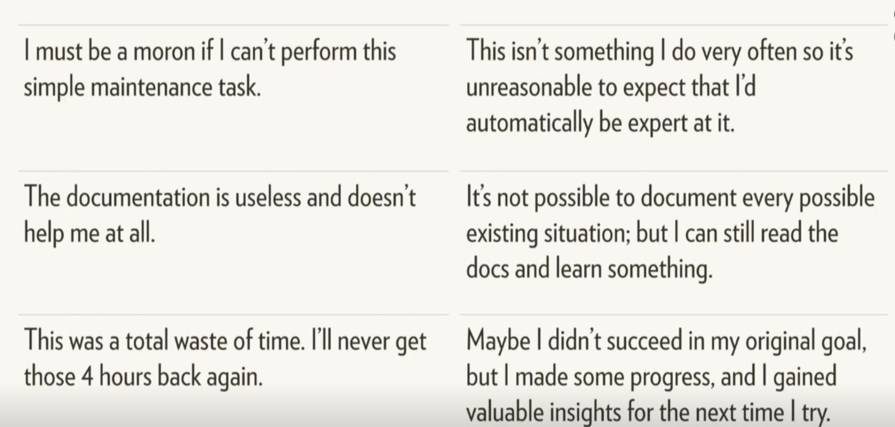

**Part of the DGfS PhD students' forum, 23 February 2021**

Instructors: Kyla McConnell and Julia Müller  
Contact us on Twitter (@McconnellKyla, @JuliaMuellerFr)  

Unless indicated, artwork is by the wonderful @allison_horst - find her on [github](https://github.com/allisonhorst/stats-illustrations).


# (1) What is this "tidyverse"?

{width=50%}


Let's jump right in and load the package:
```{r}
library(tidyverse)
```

The tidyverse is an extremely useful collection of R *packages* (i.e. add-ons to *base-R*) that help you get your data into a useful format (among other things).
Its commands/functions all have a similar structure and descriptive names to make them easier to remember and use.


**The following packages are included in the tidyverse:**  
- *ggplot2*: for data visualisation  
- *tibble*: for tweaked dataframes  
- *tidyr*: for data wrangling  
- *readr*: for reading in files  
- *purrr*: for functional programming  
- *dplyr*: for data manipulation  
- *stringr*: for string manipulation  
- *forcats*: for working with categorical variables (factors) 


## What is tidy data, and why do we use it?

**Characteristics of tidy data:**  

{width=50%}

**Why this format?**  
- a lot of wrangling commands are based on the assumption that your data is tidy 
- is expected for many statistical models
- works best for plotting 
- Hadley Wickham: "Tidy datasets are all alike, but every messy dataset is messy in its own way" 

{width=50%}


# (2) Communicating with R

## Understanding warnings and errors
R will often "talk" to you when you're running code. For example, when you install a package, it'll tell you e.g. where it is downloading a package from, and when it's done. Similarly, when you loaded the tidyverse collection of packages, R listed them all. That's nothing to worry about!

When there's a mistake in the code (e.g. misspelling a variable name, forgetting to close quotation marks or brackets), R will give an *error* and be unable to run the line. The error message will give you important information about what went wrong.
```{r}
hello <- "hi"
#Hello
```

In contrast, *warnings* are shown when R thinks there could be an issue with your code or input, but it still runs the line. R is generally just telling you that you MIGHT be making a logical error, not that the code is impossible.

```{r}
c(1, 2, 3) + c(1, 2)
```


## Reading function documentation
We'll get to know a number of R *functions* today. These functions can take one or more `arguments`. As an example, let's try out the `say()` function from the cowsay package.

First, (install and) load the cowsay package:
```{r}
# install.packages("cowsay")
library(cowsay)
```

Try the following code:
```{r}
say(
  what = "Good luck learning about the tidyverse!", 
  by = "rabbit")
```

We can see that this function has the `what` argument (what should be said?) and the `by` argument (which animal should say it?). But what other options are there for this command - which other animals, for example, or can you change the colour? To see the documentation for the `say` command, you can either run this line of code:
```{r}
?say
```
...or type in `say` in the Help tab on the bottom right.

This will show you the documentation for the command.

- *Usage* shows an overview of the function arguments and their defaults (e.g. if you typed in `say()` without any arguments in the brackets, you'd get the defaults, i.e. a cat saying "Hello world!")
```{r}
say()
```

- *Arguments* provides more information on each argument. 
Arguments are the options you can use within a function.
- what
- by 
- type
- what_color
etc. 
Each of these can be fed the `say()` function to slightly alter what it does.

- *Examples* at the bottom of the help page lists a few examples you can copy-paste into your code to better understand how a function works.

Don't worry if you don't understand everything in the documentation when you're first starting out. Just try to get an idea for which arguments there are and which options for those arguments. It's good practice to look at help documents often -- this will also help you get more efficient at extracting the info you need from them.

**-- Please work on Exercise block 1 now --**


# (3) Reading in and exploring data

Reading in data tends to follow this pattern:
```{r eval=FALSE}
name_of_data_in_R <- read_csv("data_file.csv") # equivalent to
name_of_data_in_R <- read_delim("data_file.csv", delim = ",")

name_of_data_in_R <- read_csv2("data_file.csv") # equivalent to
name_of_data_in_R <- read_delim("data_file.csv", delim = ";")

name_of_data_in_R <- read_tsv("data_file.txt") # tab-separated file
```
This works as long as the data file is saved in the same location as this file! You can add e.g. "data/" before the file name if it is located in a subfolder.


## Introducing our first dataset

Let's read in a self-paced reading dataset (saved in the data folder, so we need to add `data/` to tell R that):
```{r}
spr <- read_csv("data/dgfs_spr.csv")
```
The current dataframe is a self-paced reading experiment where 12 participants read 20 sentences each, plus 3 practice sentences to get them warmed up. In a SPR experiment, participants see one word at a time and need to press a button to be shown the next word in the sentence. Their reaction times (RTs, i.e. how long it takes them to press that button) are recorded.
Half the sentences were about dogs and half the sentences were about cats. In one condition (A), all sentences were paired with appropriate adjectival collocates according to the BNC (lap dog vs. tortoiseshell cat), in the other, these were reverse (lap cat vs. tortoiseshell dog). All sentences were presented in otherwise natural-sounding sentences. 

## Exploring our data

Now you have a data file read in, but how do you see what's in it?

```{r}
head(spr)
```

You can change the amount of rows with the `n` *argument*: 
```{r}
head(spr, n=3)
```

Or: click name of dataframe in Environment tab
  - can also sort columns and Filter rows -- just for viewing purposes
  - bit slow if you start having huge dataframes but often a good first look

There's also an easy way to see what the columns are:
```{r}
colnames(spr)
```

`summary()`: call it on a dataframe to get each column and useful info based on the data type. For example, numeric columns will show the min, median, max and the quartiles (25% increments).
```{r}
summary(spr)

summary(spr$RT)
```


## Character vs. factor columns

In the environment panel (or using `str()`), you can see that all the variables in this data are read in as either numeric or character data. However, some variables should be treated as factors because they represent categories, not text data. Let's convert them. 
```{r}
spr$participant <- as_factor(spr$participant)
spr$item_type <- as_factor(spr$item_type)
spr$cond <- as_factor(spr$cond)
```

This way, the summary output also works as expected. For example, we can have a look at how many different participants and conditions we have:
```{r}
summary(spr$participant)

summary(spr$cond)
```

If any other columns in your dataframe are read in wrong (for example, if you have a numeric column that looks like: "43", "18" and is being read as a character column) you can convert them with similar syntax: `as.numeric()`, `as.character()` etc.


# (4) The pipe %>% 

One of the most noticeable features of the tidyverse is the pipe %>% (keyboard shortcut: Ctrl/Cmd + Shift + M).

The pipe takes the item before it and feeds it to the following command as the first argument. Since all tidyverse (and some non-tidyverse) functions take the dataframe as the first argument, this can be used to string together multiple functions. 

So to re-write the `head()` function with the pipe:
```{r}
spr %>% 
  head()
```

This produces the exact same output as `head(spr)`.

Here are some more examples:
```{r}
# Equivalent to summary(spr)
spr %>% 
  summary()

# Equivalent to colnames(spr), which returns all column names
spr %>% 
  colnames() 

# Equivalent to nrow(spr), which returns the number of rows in the df
spr %>% 
  nrow()
```

You can also stack commands by ending each row (except the last one) with a pipe. 
You can see that the version with the pipe is easier to read when more than one function is called on the same dataframe! 
```{r}
spr %>% 
  colnames() %>% #extracts column names
  nchar() #counts the number of letters
```


# (5) Renaming and rearranging data

## rename()
You can rename columns with the `rename()` function. The syntax is new_name = old_name. Let's rename the `cond` variable:
```{r}
spr %>% 
  rename(condition = cond)
```

This is just a preview because we didn't assign the changed dataframe to any name. This is useful for testing code and making sure it does what you expect and want it to do.

- if you look at the spr dataframe, for example in the Environment panel on the upper-right, the dataframe hasn't changed

- To save your changes: assigning your call back to the variable name

- Good work flow: Preview then save when you're sure you're happy with the output

You can also rename multiple columns at once (no need for an array here):
```{r}
spr <- spr %>% 
  rename(condition = cond, 
         sentence = full_sentence)
```
Notice above that I've saved output over the spr dataframe to make the changes 'permanent'.

There is no output when you simply save the response, but the spr dataframe has been permanently updated (within the R session, not in your file system)

If you make a mistake: arrow with a line under it in the code block of R-Markdown, runs all blocks above (but not the current one)


## arrange()

This command lets you sort by row values: `arrange()`. By default, this sorts by lowest to highest value, but you can add `desc()` to reverse that.
```{r}
spr %>% 
  arrange(RT)

spr %>% 
  arrange(desc(RT))
```


**-- Please work on exercise block 2 now --**


# (6) Subsets

## select()

The traditional syntax for dealing with columns is dataframe$column.
A useful step in using pipes and tidyverse calls is the ability to *select* specific columns. That is, instead of writing `spr$RT` we can write:
```{r}
spr %>% 
  select(RT) 
```


### Select multiple columns 
You can also use `select()` to take multiple columns. 

```{r}
spr %>% 
  select(participant, word, RT)
```

You can see that these columns are presented in the order you gave them to the select call, too:

```{r}
spr %>% 
  select(RT, word, participant)
```

You can also use this to reorder columns in that you give the name of the column(s) you want first, then finish with `everything()` to have all other columns follow:

```{r}
spr %>% 
  select(RT, everything())
```


### Preview vs. saving

Above, we're mostly previewing using `select()` for first insights. If you look at the spr dataframe, for example in the Environment panel on the upper-right, the dataframe hasn't changed. To save your changes, assign your call back to the variable name, i.e.
df <- df %>% 
  some operations here


### Remove columns with select

You can also remove columns using select if you use the minus sign. For example, the item_type column is a factor with only one level - it always says "DashedSentence". So let's get rid of it:

```{r}
spr %>% 
  select(-item_type)
```

You can also remove multiple columns at once by writing them in an array `c()`. We'd like to remove the item type column and also the first column (X1) which seems to be just a counter.
```{r}
spr <- spr %>% 
  select(-c(item_type, X1))
```
This overwrites the data as it is saved in R. It does **not** overwrite the file that is saved on your computer.


### Leveling up select()

Until now, we've used select() in combination with the full column name, but there are helper functions that let you select columns based on other criteria.

For example, here's how we can select both the `sentence_num` and the `word_num` column - by specifying `ends_with("_num")` in the select() call:
```{r}
spr %>% 
  select(ends_with("_num"))
```

The opposite is also possible using `starts_with()`.

`contains` is another helper function. Here, we're using it to show all columns that contain an underscore:
```{r}
spr %>% 
  select(contains("_"))
```

We can also select a range of  variables using a colon. This works both with variables and (a range of) numbers:
```{r}
spr %>% 
  select(condition:word) # shows condition, word_num, word

spr %>% 
  select(1:3) # first three columns
```
Here, the order of the columns matters!

Other helper functions are:
- matches: similar to contains, but can use regular expressions
- num_range: in a dataset with the variables X1, X2, X3, X4, Y1, and Y2, select(num_range("X", 1:3)) returns X1, X2, and X3


## filter()

### Filter based on a condition

While with `select()`, you can pick **columns** by name or if they fulfill conditions, `filter()` lets you look for **rows** that fulfill certain conditions. 

{width=50%}

Use `filter()` to return all items that fit a certain condition. For example, you can use:
- equals to: ==
- not equal to: !=
- greater than: > 
- greater than or equal to: >=
- less than: <
- less than or equal to: <=
- in (i.e. in a vector): %in%

**Syntax:**
filter(data, columnname logical-operator condition)
or, using the pipe:
data %>% 
  filter(columnname logical-operator condition)

Let's look at reaction times that are shorter than 200 ms:
```{r}
spr %>% 
  filter(RT < 200)
```

...reaction times longer than or equal to 250 ms:
```{r}
spr %>% 
  filter(RT >= 250)
```

Or you can use it to select all items in a given category. Notice here that you have to use quotation marks to show you're matching a character string.
Look at the error below:
```{r}
#spr %>% 
  #filter(word == relative)
```

The correct syntax is: (because you're matching to a string)
```{r}
spr %>% 
  filter(word == "relative")
```

You can also use filter to easily drop rows. Let's drop all practice rows and save the output. 
```{r}
spr <- spr %>% 
  filter(condition != "practice")
```

To use %in%, give an array of options (formatted in the correct way based on whether the column is a character or numeric):
```{r}
spr %>% 
  filter(word %in% c("cat", "dog"))

spr %>% 
  filter(sentence_num %in% c(2, 4))
```
Note that filter is case-sensitive, so capitalization matters.

We can also specify several conditions in one `filter()` call, e.g. 
```{r}
spr %>% 
  filter(word == "relative" & RT > 200)

spr %>% 
  filter(RT > 300 | RT < 150)
```

We can also "chain" different functions, which is one of the things that makes the pipe so useful. For example, we could filter for data in condition B, which is an incomplete sentence, and only look at the words and their response times:
```{r}
spr %>% 
  filter(condition == "cond_B_dog") %>% 
  select(word, RT)
```

One useful function that can be chained to `filter()` is `distinct()`, which will return only the unique rows. Without an argument, it returns all rows that are unique in all columns. 

You can also add a column name as an argument to return only the unique values in a certain column (useful with factors)

```{r}
spr %>% 
  filter(condition == "cond_B_dog") %>% 
  distinct(sentence)
```

You can also use it on its own to return unique values or combinations of values.

```{r}
spr %>% 
  distinct(sentence, condition)
```


**-- Please work on Exercise block 3 now --**


# (7) Separating and uniting columns

For the next two examples, we'll use a different dataset called `animal_corpus`. Read it in and familiarise yourself with its contents.
```{r}
animal_corpus <- read_csv2("data/cat_dog_corpus_data.csv")
```

This contains corpus data of "cat" and "dog" together with the words that precede "cat" and "dog". These are called "collocates" and, in our example, also include part of speech tags (the format is word_tag).

This data is not tidy. Why?

The collocates column contains two variables (word and tag) although according to tidy data principles, each variable should be saved in its own column.

## separate()

Luckily, the tidyverse has a command for that: `separate()`. It takes the following arguments:
- data: our dataframe, we'll pipe it
- col: which column needs to be separated
- into: a vector that contains the names of the new columns
- sep: which symbol separates the values
- remove (optional): by default, the original column will be deleted. Set `remove` to FALSE to keep it.

```{r}
(animal_corpus <- animal_corpus %>% 
  separate(col = coll, 
           into = c("coll", "coll_tag"), 
           sep = "_"))
```

Another example: In the SPR data, the condition column contains two pieces of information: which condition the item was in (condA or condB) and which animal was being read about (cat or dog)
```{r}
(spr <- spr %>% 
  separate(condition,
           into = c("condition", "animal"),
           sep = "_"))
```


## unite()

The opposite of `separate()`. This lets you glue columns together. 
- col is the name of the new column
- the next argument, a vector, lists the columns that should be united
- sep, as above, lets you specify how the values should be separated

Let's say we'd like our data to be in the format "collocate cat/dog", so without the tag, but in one column, separated by a space. 
```{r}
animal_corpus %>% 
  unite(col = "coll_word",
        c("coll", "animal"),
        sep = " ")
```

This leads to a lot of repetition - some bigrams appear several times in just our preview. To remedy this, we can use `distinct()`, which only keeps unique rows. To make clear that we want unique collocate cat/dog combinations, we can put `coll_word` into `distinct()` to make clear that this is the relevant column and tags should be ignored.
```{r}
animal_corpus %>% 
  unite(col = "coll_word",
        c("coll", "animal"),
        sep = " ") %>% 
  distinct(coll_word)
```

# (8) Creating and changing columns with mutate()

With the `mutate()` function, you can change existing columns and add new ones. 
The syntax is:
mutate(data, col_name = some_operation)
or, with the pipe: 
data %>% mutate(col_name = some_operation).

{width=50%}

The response times are measured in ms. Let's convert them to seconds by dividing by 1000:
```{r}
(spr <- spr %>% 
  mutate(RT_s = RT / 1000))
```
Now, there's a new column called RT_s (it's at the very end by default).

You can also save the new column with the same name, and this will update all the items in that column (see below, where I divide response times by 1000, but note that I don't save the output):
```{r}
spr %>% 
  mutate(RT = RT / 1000)
```

You can also do operations to character columns - for example: 
```{r}
(spr <- spr %>% 
  mutate(word = tolower(word)))
```


## Change data type in a column

We can also change data types using `mutate()`. Instead of the code we used earlier to convert participant and condition to factors, we could write: 
```{r}
(spr <- spr %>% 
  mutate(participant = as_factor(participant),
         condition = as_factor(condition)))
```
As you can see, we can change several variables within one `mutate()`  call. In the same way, we could create several new columns at the same time. Here, dropping each new column onto a new line is considered good style and makes the code more readable (but it's not necessary).

## Relabel factors
In our SPR experiment, condition A represents a match (i.e. cat/dog is presented with a matching collocate: purring cat, guide dog) and condition B is a mismatch (e.g. guide cat, purring dog). To make this clear in the data, we should label this explicitly. Within a `mutate()` command, we can use `recode()` to change the factor labels. The format for this is old label = "new label".
```{r}
(spr <- spr %>% 
  mutate(condition = recode(condition, 
                            condA = "match", condB = "mismatch")))
```

Let's look at our third dataset, animal_survey. It contains data from the same participants who answered a few sociodemographic questions and also indicated how cute they think animals are, how much they('d) like look at, pet, and own an animal (scale: 1-5). Besides that, they were also asked to rate cats and dogs (scale: 1-7).
```{r}
animal_survey <- read_csv("data/animal_survey.csv")
```

In our animal_survey data, education is represented by numeric codes, 1-4. We could turn these into labels like so:
```{r}
(animal_survey <- animal_survey %>% 
  mutate(education = recode(education,
                            "1" = "elementary school",
                            "2" = "high school",
                            "3" = "Bachelor's degree",
                            "4" = "Master's degree or higher"
                            )))
```
Because these numbers should be treated as characters, we need to put them in quotation marks!


## If-else-statements

Now for something fancy. You can also make new columns based on "if" conditions using the call `ifelse()`. The syntax of ifelse is: ifelse(this_is_true, this_happens, else_this_happens). For example, we could create a column called "RT_short" that contains "short" if the response time is faster than 100 ms and "long" if it isn't:

```{r}
spr %>% 
  mutate(RT_short = ifelse(RT < 100, "short", "long")) %>% 
  select(RT, RT_short)
```

You can also use ifelse on categorical / character columns:
```{r}
(spr <- spr %>% 
  mutate(position = ifelse(word %in% c("cat", "dog"), "critical", "not critical")))
```


## Several conditions: case_when()
What if you have several conditions? For example, if RTs are shorter than 100 ms, they should be labelled "short", if they're longer than 500 ms, "long", and "normal" for all other RTs. While it's possible to chain several `if_else()` statements, it gets confusing and hard to read. Instead, we should use `case_when()`.

{width=50%}

The syntax within `case_when()` is:
condition ~ what to do if it is true (can be used as often as you want and can even refer to different variables!),
TRUE ~ what to do in all other cases.
```{r}
spr %>% 
  mutate(RT_category = case_when(
    RT < 100 ~ "short",
    RT > 500 ~ "long",
    TRUE ~ "normal"
  )) %>% 
  select(RT, RT_category)
```


Another example: In the questionnaire, participants were asked to indicate how much they like cats and dogs, respectively. We can convert this information into a category. To create a variable called "preference", we can use the following `case_when()` statement:
```{r}
(animal_survey <- animal_survey %>% 
  mutate(preference = case_when(
    cats > dogs ~ "cats",
    dogs > cats ~ "dogs",
    TRUE ~ "undecided"
  )))
```
If we look at the output, we see that the "else/TRUE" condition wasn't necessary, strictly speaking, but it's good to account for all the potential cases in the data so you don't end up with superfluous NAs.


**-- Please work on Exercise block 4 now --**


# (9) Summary tables with groupings

## summarize()

Let's extract some information on the reaction times in the self-paced reading data. If we want to do this the tidy way, we can use `summarise(operation(variable))`.

You can use multiple different operations in the summarize part, including:
- mean(col_name)
- median(col_name)
- max(col_name)
- min(col_name)

So to get the average RTs:
```{r}
spr %>% 
  summarise(mean(RT))
```

...and the median RTs:
```{r}
spr %>% 
  summarise(median(RT))
```

By default, the column is labelled "mean(RT)" or "median(RT)", respectively. We can set our own names, though:
```{r}
spr %>% 
  summarise(average_RT = mean(RT))
```


## group_by() 
In our SPR experiment, we showed matching and mismatching collocate + cat/dog combinations, so we might assume that the mismatched combinations were read more slowly. We'd like to see the average RTs for each condition.

To look at summary statistics for specific groupings like these, we have to use a two- (more like three-) step process. 

First, group by your grouping variable (here: condition) using `group_by()`
Then, summarize, which creates a column based on a transformation to another column, using `summarize()` or `summarise()`
Finally, ungroup (so that R forgets that this is a grouping and carries on as normal, with `ungroup()`
Usually this makes no difference to what you see but is an important fail-safe if you're continuing in the code block. For example, if you need to drop the former grouping variable and don't use `ungroup()`, R will refuse to drop it.

{width=50%}

For example, to return the average RT in each condition:
```{r}
spr %>% 
  group_by(condition) %>% 
  summarize(mean(RT)) %>% 
  ungroup()
```

You can also give a name to your new summary column: 
```{r}
spr %>% 
  group_by(condition) %>% 
  summarize(average_RT = mean(RT)) %>% 
  ungroup()
```

Or further manipulate it, e.g. converting ms to seconds:
```{r}
spr %>% 
  group_by(condition) %>% 
  summarize(average_RT_s = mean(RT) / 1000) %>% 
  ungroup()
```

## count()
For categorical columns, you can also count how many rows are in each category using `count()` instead of `summarize()`. Here, we're counting how often which word appeared in the experiment. The count is displayed in the new "n" column:
```{r}
spr %>% 
  group_by(word) %>% 
  count() %>% 
  ungroup()
```

This is sorted alphabetically, but we can pipe it into the `arrange()` call we discussed earlier to sort by frequency, in descending order.
```{r}
spr %>% 
  group_by(word) %>% 
  count() %>% 
  ungroup() %>% 
  arrange(desc(n))
```

You can also group by more than one column to return the unique combinations of the variables.
```{r}
spr %>% 
  group_by(condition, animal) %>% 
  summarize(mean(RT)) %>% 
  ungroup()
```


# (10) across()

`across()` is a helper for `mutate()` and `summarise`. It lets you easily apply a change or create a summary for several variables because you can use `select()` semantics (`starts_with()`, `ends_with()`, `contains()`, etc.) with `across()`.


For example, if we'd like to see the mean for columns that end with "num":
```{r}
spr %>% 
  summarise(across(ends_with("num"), mean))
```

This also works with a list of functions, e.g. the mean and the standard deviation:
```{r}
spr %>% 
  summarise(across(ends_with("num"), c(mean, sd)))
```

Here's an example of `across()` in a `mutate()` function. This lets you easily convert all character variables into factors:
```{r}
spr %>% 
  mutate(across(where(is.character), as.factor))
```

## Row-wise operations
Back to our questionnaire. For each participant, we'd like to calculate the average of the columns that start with "animals" to get one measure of their interest in animals. We might try something like this:  
```{r}
animal_survey %>% 
  summarise(across(starts_with("animals"), mean))
```

As you can see, R gives us the averages for each of the columns, across all participants - not what we're looking for! The reason for this is that R is best at computing over columns. To solve our problem, we need to add `rowwise()`. This is similar to the grouping idea (`group_by()`) we came across a little earlier. Here, we're telling R to treat every row as a single "group". We can then use `c_across()`, which is the version of `across` that works with row-wise operations. We also need `mutate()` because we want to create a new column rather than see a summary:
```{r}
(animal_survey <- animal_survey %>% 
  rowwise() %>% 
  mutate(
    pet_interest = mean(c_across(starts_with("animals")))
  ))
```

**-- Please work on exercise block 5 now--**


# (11) Reshaping data 

Now, let's look into how to change the shape of your data. There are two options here:
- making your data "longer", i.e. increase the number of rows and decrease the number of columns
  - useful for tidying data, especially common with "wild-caught" data
  - command: `pivot_longer()` (older command: `gather()`)
- making your data "wider", i.e. decrease the number of rows and increase the number of columns
  - not (as) common for tidying but for creating summary tables
  - command: `pivot_wider()` (older command: `spread()`)


## pivot_longer()
Let's take another look at the questionnaire data. The format it is in is typical for questionnaire data as you would export it from host sites. The data from each person is represented on one line. This can be useful for some operations (like in the `case_when()` we used to create the "preference" variable) but a problem for other applications, so let's tidy this using `pivot_longer`. 
Specifically, we have an issue with the dog and cat ratings being in separate columns. Instead, we should have a column called "animal", which contains either "cats" or "dogs", and another column that contains the rating.

The basic `pivot_longer` arguments are:
cols: which columns should be reshaped?
names_to: the name of the variable that the original column names ("cats" and "dogs") should be stored in as values
values_to: the name of the variable that the contents of the variables should be stored in
```{r}
animal_survey %>% 
  pivot_longer(cols = c("cats", "dogs"),
               names_to = "animal",
               values_to = "rating")
```

Another example: This next file contains the averages of acceptability judgements for the sentences we used in the experiment (we'd expect that sentences which contain mismatching collocates such as "barking cat" are rated as less acceptable than sentences with matching collocates). Let's read it in:
```{r}
acc_judge_original <- read_csv("data/acceptability_judgements.csv")
```
We can see that this data is in a very wide format - each column name contains one of the sentences, and the only row consists of the average acceptability judgements.

What we'd like instead is a column that contains all the sentences and another column that contains all the averages.
```{r}
(acc_judge <- acc_judge_original %>% 
  pivot_longer(
    cols = everything(), # we want to reshape the entire data, so all variables are concerned
    names_to = "sentence",
    values_to = "rating"
  ))
```

## pivot_wider()
While `pivot_longer()` is often used to tidy data, its opposite `pivot_wider()` is more common when creating and reformatting summary tables. For example, let's first count how often "cat" and "dog" occur with each collocate:
```{r}
animal_corpus %>% 
  group_by(animal, coll) %>% 
  count() %>% 
  ungroup() 
```

Looks like it's working! However, we'd like to reshape this data into a more typical contingency table-like format, with "cat" and "dog" as row labels, and the collocates as column labels.  
We can use `pivot_wider()` to achieve this. Its main arguments are:
names_from: where should the new column names come from?
values_from: where should the corresponding values come from?
```{r}
animal_corpus %>% 
  group_by(animal, coll) %>% 
  count() %>% 
  ungroup() %>% 
  pivot_wider(
    names_from = coll,
    values_from = n
  )
```


# (12) Joining several data sets
Let's add the acceptability judgement data to the SPR data: we want to "join" the two datasets into one, so each sentence should be matched up with its average rating. There are several join commands, which differ in how they match up datasets and which cases are kept or discarded. 
Their syntax is:
xxxx_join(dataframe1, dataframe2, by = "column that is present in both dfs")


The column "sentence" is what we need to match up acceptability judgements with the SPR data. When joining, it's often a good idea to create a new dataframe instead of overwriting any of the old ones.
```{r}
spr_acc <- full_join(spr, acc_judge, by = "sentence")
```

A quick glance at the Environment tab confirms that we now have a dataframe with the same number of rows ("observations") but one more column, just as we want. But when joining data, plenty of things can go wrong, so let's look at the data:
```{r}
spr_acc %>% 
  select(sentence, rating) %>% 
  distinct()
```

Looks fine! Let's follow the same procedure to add participant information to this new dataset:
```{r}
spr_acc_participants <- full_join(spr_acc, animal_survey, by = "participant")
```

As a final example, we'll read in one last, very simple, dataset. It contains the raw frequencies of each of the words participants read in the SPR experiment (word frequency tends to be a good predictor of reading times: more common words are usually read faster). Let's have a look:
```{r}
corpus_frequencies <- read_tsv("data/corpus_frequencies.csv")
```

We'd like to add the word frequency to our data, so the column to match by is "word" in the spr data but it's called "token" in the corpus data. To join this, we can either rename one of these or use a vector in `by()` which lists the two column names as they appear in the dataframes:
```{r}
spr_complete <- full_join(spr_acc_participants, corpus_frequencies, by = c("word" = "token"))

rm(spr_acc, spr_acc_participants) #remove dfs to keep the environment clean
```

Other options: 
- semi_join
- anti_join
- bind_rows
- bind_cols


# (13) Writing files to disk

To write files to disk, you also need to select which separator you want to use -- do you want a comma-separated file or a tab-separated file? In theory, this shouldn't matter much, you just have to know which you pick. 

CSVs are often saved as .csv (this is also openable in Excel) and TSVs are often saved as .txt

You can save CSVs and TSVs like so:
```{r}
# write_tsv(spr_complete, "spr_df.txt")

# write_csv(spr_complete, "spr_df.csv")
```
Syntax: write_tsv(dfname, "filename.ext")

Remember, something like data type in R (ex: character or factor) can't be saved into one of these files -- it just saves the values separated by the separator (and the column names). So you'll still have to do the conversions next time you read the file into R. 


**-- Please work on exercise block 6 now--**


# (14) Intro to ggplot 

{width=50%}
### The layered grammar of graphics
ggplot follows the grammar of graphics. 

Layer 1: Data

You can see, at this stage we have, well... nothing!
```{r}
ggplot(data = spr_complete)
```

Layer 2: *aesthetic mappings* -- how should the data be matched to the graphics (e.g. which variable is shown on the x-axis, which one is shown on the y-axis)?

Note: ggplot uses + to continue a line of code; this has to come at the END of the previous line.

When we tell ggplot how we want the aesthetics mapped, it can already start to set up the axes. However, it doesn't yet know what type of graph we're building:
```{r}
ggplot(data = spr_complete) + 
  aes(x = condition) 
```

Layer 3: *geom*  -- the type of plot we're making. This may be a bar chart, a line graph, a scatterplot, or many more options we'll explore below!

Let's try a bar chart -- ggplot automatically counts up how many items are left in each condition.
```{r}
ggplot(data = spr_complete) + 
  aes(x = condition) +
  geom_bar()
```

### Other geoms

#### For one variable

Bar charts show how many rows are in each group, like above.

```{r}
ggplot(data = spr_complete) +
  aes(x = education) +
  geom_bar()
```

To show the distribution of one continuous variable, a histogram is useful. Histograms take a continuous variable and divide it into *bins*. 
```{r histogram}
ggplot(data = spr_complete) +
  aes(x = RT) +
  geom_histogram()
```

R warns you that it has simply used the default number of bins (30).  However, you can change this and see how it changes your idea of the distribution. Change this with the argument `bins=` inside of the geom_histogram()

```{r}
ggplot(data = spr_complete) +
  aes(x = RT) +
  geom_histogram(bins = 50)
```

Density plots are a variation of histograms where a smooth line instead of separate bars is drawn. This can be useful for a larger number of data points but can also hide some nuance.
```{r density plot}
ggplot(data = spr_complete) +
  aes(x = RT) +
  geom_density()
```


#### For two variables

For two continuous variables, we can use a scatterplot with `geom_point()` to show one dot per data point, defined against two continuous axes, like we saw in the example.

```{r}
ggplot(data = spr_complete) +
  aes(x = RT, y = log(frequency)) +
  geom_point() 
```

We can also use a (smoothed) line to represent the same data:
```{r}
ggplot(data = spr_complete) +
  aes(x = RT, y = log(frequency)) +
  geom_smooth() 
```

Here comes the cool part about ggplot.. you can also do both at the same time! Simply add both geoms to the same plot:

```{r}
ggplot(data = spr_complete) +
  aes(x = RT, y = log(frequency)) +
  geom_point() +
  geom_smooth()
```


In the boxplot below, the thick line in the middle is the median, the bottom of the box is the 1st Quartile and the lines reach up to the minimum and maximum values (shown as dots if they are extreme, i.e. they are outside of 1.5x the range from 1st to 3rd quartile: the interquartile range).

```{r boxplot}
ggplot(data = spr_complete) +
  aes(x = condition, y = RT) +
  geom_boxplot()
```

A violin plot is a bit like a histogram turned on its side and mirrored, and also shows where the data is located for each group.
```{r violin plot}
ggplot(data = spr_complete) +
  aes(x = condition, y = RT) +
  geom_violin() 
```

It pairs well with a boxplot!
```{r plot}
ggplot(data = spr_complete) +
  aes(x = condition, y = RT) +
  geom_violin() + 
  geom_boxplot() #try adding alpha = 0.5
```


## Adding more information

### Fill vs. color

Fill is used for filling in larger spaced like entire bars. Color is used for smaller sections like dots or lines. 

### colour
Let's return to one of the first plots we made. Here, we can add a color argument to the *geom* call that calls a normal color (*in quotes*). This will make all the points this color. 
Note: if you know what hex codes are (or just use a hex code finder online), you can use all sorts of custom colors.
```{r}
ggplot(data = spr_complete) +
  aes(x = condition, y = RT) +
  geom_boxplot(color= "pink")
```

However, we can also use the color argument to introduce a third variable into the picture. If we are calling a variable/column, we do *not* need quotes AND we need to put it in the *aes* part of the call, becuase it is a -mapping- not a simple color.
```{r}
ggplot(data = spr_complete) +
  aes(x = condition, y = RT, color = animal) +
  geom_boxplot()
```

Here's what happens if you try to put a plain color inside of the aes mapping... R doesn't find this variable, so it just randomly creates it..
```{r}
ggplot(data = spr_complete) +
  aes(x = condition, y = RT, color = "pink") +
  geom_boxplot()
```

### fill
Bar charts and other charts with pretty large open spaces usually need fill. Fill works the same as color in that it can either go *inside aes() as a mapping* or *inside the geom, with quotes, as a plain color*.
```{r}
ggplot(data = spr_complete) +
  aes(x = education, fill = gender) +
  geom_bar()
```


Bar plots can actually also take color, but this affects the color of the lines only:
```{r}
ggplot(data = spr_complete) +
  aes(x = education, color = gender) +
  geom_bar()
```

Or mix and match!
```{r}
ggplot(data = spr_complete) +
  aes(x = education, fill = gender) +
  geom_bar(color = "yellow")
```


## Labels

You can change most labels by using the `labs()` command, which as a lot of arguments for changing different parts of text.
```{r}
ggplot(data = spr_complete) +
  aes(x = condition, y = RT, color = animal) +
  geom_boxplot() +
  labs(x = "Condition", 
       y = "Response Time",
       colour = "Animal in stimulus", # this works the same way for fill
       title = "Response times by condition",
       subtitle = "To cat and dog collocates",
       caption = "Made by me")
```

## Piping into a ggplot
A great feature of ggplot is that it works with the pipe, so that you can also do:
```{r}
spr_complete %>% 
  ggplot() +
  aes(x = education, fill = gender) +
  geom_bar()
```

And naturally, edit the dataframe before using any of the commands above!
```{r}
spr_complete %>% 
  filter(education != "elementary school") %>% 
  ggplot() +
  aes(x = education, fill = gender) +
  geom_bar()
```


**-- Please work on exercise block 7 now--**


# (15) Getting help

We hope to have provided you with a lot of tools and knowledge today that will help you work with your data! However, it obviously isn't possible to cover all tidyverse functions that might be useful for your own data cleaning and analysis. Similarly, this often isn't as smooth a process as we've presented here today. Sometimes, you're not sure which commands to use, or which arguments a function has, or even which format your data actually needs to be in! This can be a frustrating experience, so we wanted to share some suggestions for how to re-frame negative thoughts and turn them into more positive and encouraging ones:



## Function documentations & vignettes

As we showed you earlier, the function documentation (access via `?function` or by typing the function into the "Help" panel on the bottom right) is really useful, but don't expect to understand every single detail (that's usually not necessary anyway for figuring out how to make it work or if you're mostly checking how to spell an argument, etc.). If you're trying to learn how to use a new function or remind yourself of functions you haven't used in a while and are finding it hard to wrap your head around it by just reading the documentation, scroll all the way down to the examples and play around with those. 

For some functions, **vignettes** are available. For instance, if you search for help on either of the two pivoting functions, you'll be directed to a vignette on pivoting. Enter `vignette("pivot")` to access it. It'll open in the Help window and is more like a detailed tutorial with lots of example data to help you understand more complex functions.

By the way: We haven't had time to discuss *all* arguments that each of the functions we learned today can take, so if you think a particular function might almost solve your problem, check its documentation - maybe there's an extra argument that does exactly what you're looking for!


## Working with Google results

If you encounter a specific problem but aren't sure which function to use (or if you're trying to use a command you know in a very specific way), it's often a good idea to simply google the question (and the same goes for error messages - after you double-checked spelling, capitalisation, commas, missing brackets...). R generally has a large and helpful community, so you'll likely find answers on sites such as Stack Overflow or, if you're lucky, even entire blogposts written on a relevant issue.


# (16) Workflows/code conventions

## Packages
When installing new packages, don't put the code for that in your script - you don't want packages to be installed every time you run a script when they're already there.
Always list and load all packages at the top of your script!

## Naming conventions
Give expressive names to your variables and dataframes/tibbles. Don't just call everything "data", "df", or "variable1", "var1", etc., but use names that immediately tell you what the variable contains.
Use consistent naming conventions for variables. For example, if you use an underscore to separate words in one multi-word variable name, use the same symbol everywhere.
Similarly, be consistent with capitalisation - the recommendation here is to use lowercase for all data and variable names to reduce the chance of misspelling variables.

## Line breaks
Throughout these materials, we've been using line breaks after pipes and often also after each argument of a function. This is purely for readability's sake - optional, but highly recommended!
We've also consistently assigned to the dataframe (e.g. spr <- spr %>% some commands) at the beginning of a code block, although it's also possible to do that at the end of the code block. 

## Building up code blocks/chaining commands
When working on a (more) complex data wrangling problem, you'll often need to take several steps towards your goal, i.e. use several commands to arrive at a tidy and workable dataframe. If you're stuck at this step, think about what you want your data to look like, then identify single steps towards that form, then think about how to express each of these in R. It often helps to draw or take notes on paper to better think through this process!
In terms of actually writing code, ideally also build it up step by step and don't save your changes until you're certain they are what you want. Sometimes, it can also be a good idea not to overwrite the original dataframe but to save it under a different name, e.g. for major restructuring such as pivoting or joining.


# Additional materials

## Miscellanous commands we didn't have time for today
- `package::command` for specifying which package a command should be taken from if you have packages loaded which use the same command names
- `relocate()` to change the order of columns
- `replace_na()` to replace NAs with a specific value and the reverse, `na_if()`to replace selected values with NA (e.g. when downloading questionnaire data, missing answers might be coded as -9)
- `coalesce()` to combine two variables and replace missing values in either of them (which is often a result from joining dataframes with columns that have different names)
- `lag()` and `lead()` to find previous or next values. Useful in e.g. SPR or eyetracking to look at the frequency or RT of the previous word.
- `cumsum()`, `cumprod()`, `cummax()`, `cummin()` for cumulative sums, products, minima or maxima
- `top_n()` for the top results (e.g. to see the five most frequent collocates for each "cat" and "dog")
- `sample()` or `sample_frac()` to take a random sample from your data, e.g. to extract sentences for qualitative analysis or to test commands on a smaller dataset when working with large data
- `str_squish()` to remove superfluous whitespace (e.g. "cute     cat") in a string
- `parse_number()` to extract only numbers from a string (e.g. "USD18" -> "18")


## Additional exercises
Check the "more exercises" folder to find:
- More on ggplot
- An advanced pivoting exercise


## Resources and cheat sheets

- [Online book: R for Data Science](https://r4ds.had.co.nz/index.html)
- [Collection of cheat sheets](https://rstudio.com/resources/cheatsheets/)
- [Article: Ten Up-To-Date Ways to do Common Data Tasks in R](https://towardsdatascience.com/ten-up-to-date-ways-to-do-common-data-tasks-in-r-4f15e56c92d)
- [Article: Five Tidyverse Tricks You May Not Know About](https://towardsdatascience.com/five-tidyverse-tricks-you-may-not-know-about-c5026d5a19da)
- dplyr tutorials: [Part 1](https://www.kaggle.com/jessemostipak/dive-into-dplyr-tutorial-1) and [part 2](https://www.kaggle.com/jessemostipak/dive-deeper-into-dplyr-tutorial-2)
- [Article: 10 Must-Know Tidyverse Features](https://www.r-bloggers.com/2020/10/10-must-know-tidyverse-features/)
- [Introductory tutorials on data vis and wrangling in R](https://r-bootcamp.netlify.app/)


